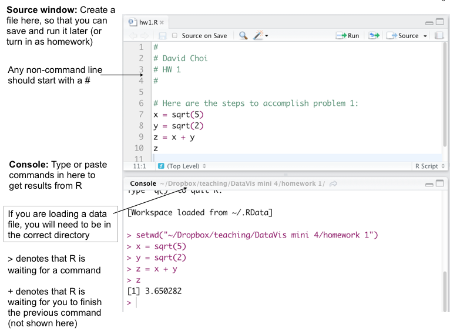
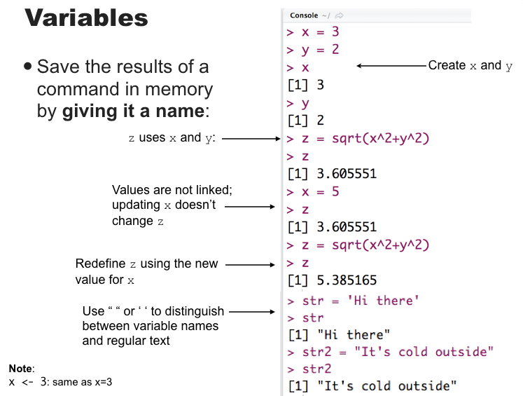
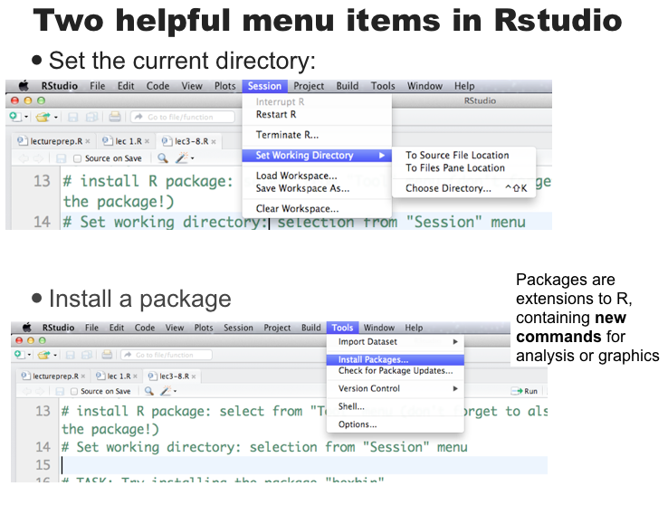

```{r setup, include=FALSE}

knitr::opts_chunk$set(echo = TRUE, cache = TRUE, message=FALSE, warning=FALSE, comment=NA, fig.align='center', fig.keep='last')

knitr::knit_hooks$set(mysize = function(before, options, envir) {
  if (before) 
    return(options$size)
})

setwd("~/danielmarcelino.github.io/resources/teaching/analytics/Portuguese")
```


## Objetivos dessa apresentação
  
  - Visão geral do curso 
  
  - Introdução ao R, RStudio e documentos dinâmicos em RMarkdown
  
  - Programação básica
  
  - Gerar gráficos e tabelas a partir de dados
    
  - Entrar, ler e importar dados
  
  - Integrar R com outras ferramentas (databases, C/C++, web)


## Recursos para o curso

 - Nenhum material é requerido, mas alguns livros são __recomendáveis__ para quem quer ir adiante do que será tratado aqui:
  **Português:**
	  - Jackson Aquino, _R Para Cientistas Sociais_ 
	  - Paulo Justiniano, _Introdução ao Ambiente Estatístico R_  [(online)](http://www.leg.ufpr.br/~paulojus/embrapa/Rembrapa/)
	
	**Inglês:**
    - Phil Spector, _Data Manipulation with R_
    - Paul Teetor, _The R Cookbook_
    - Winston Chang, _The R Graphics Cookbook_
    - Norman Matloff, _The Art of R Programming: A Tour of Statistical Software Design_
      
- Websites especializados para todo o resto.


## Por quê usar R?

- **Visualização de dados**;

- **Reproduzibilidade**;

- O R "puro" é programado somente por linha de comando, MAS existem ambientes para facilitar a programação, inclusive opções de versões "point-and-click";

- Oferece a maior cobertura de ferramentas (pacotes de funções) do planeta para programação científica;

- Fácil de gerar e reproduzir relatórios (dinâmicos); 

- Fácil de integrar com outras ferramentas;

- Massivamente utilizado em projetos de data science; 

- Grátis (open-source)

- [Artigo no New York Times discutindo como R está se tornando a língua franca entre analistas de dados em todas as áreas](http://www.nytimes.com/2009/01/07/technology/business-computing/07program.html?_r=1&em)
 

## R via Console
- A interação básica com o R é via **console**, **terminal** ou **linha de comando**

- Isso significa que você digita comandos, R devolve respostas (ou erros). 

- Menus e interfaces gráficas são **extras** geralmente criados para rodar sobre o console básico. 

- Nós iremos usar o **RStudio** neste curso. 

1. Baixe o R: http://cran-r.c3sl.ufpr.br

2. Depois baixe o RStudio: http://www.rstudio.com/


## O Painel do RStudio { .cover .white }
  


## RStudio: Painel
O Rstudio tem 4 janelas principais ('painéis'):

1. The __Source__ pane: cria um arquivo que você pode salvar e executar depois. 
2. The __Console__ pane: Lugar onde se pode digitar ou colar comandos para gerar resultados.
3. The __Workspace/History__ pane: Mostra uma lista de variáveis e comandos executados anteriormente.
4. The __Files/Plots/Packages/Help__ pane: Nesta janela são mostrados os gráficos, páginas de ajuda, e outros itens. 


## RStudio: Source and Console panes { .cover .white }




## RStudio: Console { .cover .white }
                  



## RStudio: Toolbar { .cover .white }
  



## R Markdown { .cover .white }


## R Markdown { .cover .white }


## Básico: a classe  class in a nutshell


## Fundamentos da estrutura de dados

Você irá encontrar diferentes tipos de dados:

- **Booleans**: valores binários do tipo: `TRUE` (VERDADEIRO) ou `FALSE` (FALSO) no R;

- **Integers**: números inteiros (positivos, negativos ou zeros);

- **Floating point numbers**: uma fração (com um número finito de bits) vezes um valor exponêncial, como $1.87 \times {10}^{6}$;

- **Characters**: comprimento-fixo de bits, com codificação especial;

**strings**: sequência de caracters binários

- **Missing, dados ausentes e valores não definidos**: `NA`, `NaN`, etc.


## Tipos de objetos de vetores 
### Lógicos/Booleans
```{r}
V <- TRUE

print(class(V))
```

----

### Integers/Números Inteiros
```{r}
V <- 2L

print(class(V))
```

----

### Numeric/Números
```{r}
V <- 23.5

print(class(V))
```

----

### Character/Strings
```{r}
V <- "TRUE"

print(class(V))
```

----

### Complex
```{r}
V <- 2+5i

print(class(V))
```

----

### Raw
```{r}
V <- charToRaw("Hello")

print(class(V))
```


## Mais tipos
 
- `typeof()` função para retornar o tipo

- `is.`_foo_`()` função para retornar um valor booleano se o argumento for do tipo _foo_

- `as.`_foo_`()` (tente) "alocar" o argumento para o tipo _foo_ --- tente converter de uma forma razoável para um tipo _foo_ de valor.

- **Caso especial**: `as.factor()` será importante no futuro para dizer ao R quando alguns números na verdade representam uma convenção (variável categórica) ao invés de números propriamente dito. 
<small> (Ex, 1 = Ensino Básico; 2 = Superior; 3 = Pos-graduação) </small>


## Exemplos
```{r}
typeof(5)
is.numeric(5)
is.na(5)
```
  
## Mais exemplos
```{r}
is.character(5)
is.character("5")
is.character("cinco")
is.na("cinco")
```
  
  

## Operadores (funções básicas)
Obtendo ajuda no R

 # abre a página de ajuda do termo 'commando'
- ?commando 


# Vai pesquisar por todos os commandos que têm alguma string  relacionada ao "texto-da-busca"

- help.search("texto-da-busca")

# Abre uma janela do navegador de internet e faz buscas em sites relacionados ao termo da busca "text0"

- RSiteSearch("texto")              


## Operadores (funções básicas)
Você pode usar o R como uma calculadora

Comando | Descrição
--------|-------------
`+,-,*,\` | adição, subtração, multiplicação, divisão
`^` | multiplicar pela potência de
`%%` | remanescente depois da divisão  (ex: `8 %% 3 = 2`)
`( )` | mudar a ordem de operações
`log(), exp()` | logarítmo e exponentes (ex: `log(10) = 2.302`)
`sqrt()` | raíz quadrada
`round()` | arredonda para número inteiro mais próximo (ex: `round(2.3) = 2`)
`floor(), ceiling()` | arredonda para baixo ou para cima, respectivamente
`abs()` | obter o valor absoluto


## Simple arithmetic
```{r}
5+2 # Adicão
5-2 # Subtração
5*2 # Multiplicação
5^2 # Exponenciação
```

## Division in R
```{r}
5/2 # Divisão
5 %% 2 # Modulus
5 %/% 2 # divisão de números inteiros 
```
- Note: que em algumas linguagens, `5/5` seria interpretado como divisão de números inteiros. 

## Operadores continuação 

 **Comparações** são também operadores binários que aceitam dois objetos, como números, e uma verificação booleana.
  
```{r}
5 > 4
5 < 4
5 >= 5
5 <= 4
```

## Mais operadores 

```{r}
5 == 4
5 != 4
```

Note o duplo `==` para comparação de igualdade 

## Operadores booleanos (AND, OR, AND NOT).

Operadores booleanos (George Boole) são palavras ou grupos de palavras que podem ser combinados de diferentes formas para modificar o resultado de uma operação. As formas mais comuns são basicamente "E" e "OU":
  
```{r}
(5 > 7) & (6*7 == 42)
(5 > 7) | (6*7 == 42)
```


## Variáveis
  Nós podemos atribuir nomes para os objetos (dados), o que nos dá **variáveis**
  
Algumas variáveis básicas já estão presentes:
```{r}
pi
```

----

Variáveis podem servir de argumentos para funções ou operadores, assim como __constantes__ ou escalares:

```{r}
pi*10
cos(pi)
```

----

### Assignment operator
  
Most variables are created with the **assignment operator**, `<-` or `=`  
  
```{r}
approx.pi <- 22/7
approx.pi
diameter.in.cubits = 10
approx.pi*diameter.in.cubits
```

----

### Note que o operador de atribuição também modifica valores:

```{r}
circumference.in.cubits <- approx.pi*diameter.in.cubits
circumference.in.cubits
circumference.in.cubits <- 30
circumference.in.cubits
```


## Variáveis 

- Usando nomes e variáveis tornam o código (programa) mais fácil de executar e debugar, menos propenso a erros, além de ser mais fácil para outros lerem.

- Evite "constantes mágicas"; habitue-se a usar variáveis.

- Use nomes que tenham significado claro:
    - Bom: `num.estudantes <- 25`
    - Não bom: `n <- 25 `

  
  
## A área de trabalho (workspace)
 
  Quais nomes você já tem definido em seu espaço de trabalho?
  
```{r}
ls()
```

Removendo variáveis:
```{r}
rm("circumference.in.cubits")
ls()
```


